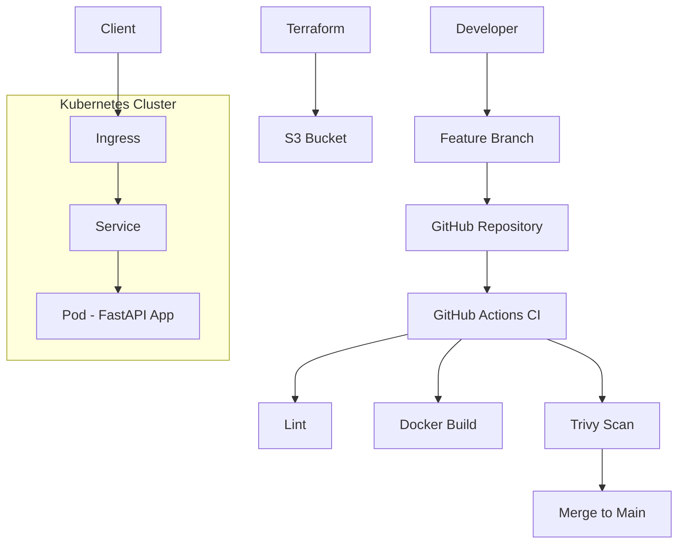

# DevOps Jr Challenge – Hubii 🚀

## 📌 Sobre o Projeto

Este projeto foi desenvolvido como parte de um desafio técnico para a vaga de DevOps Jr, com foco em fundamentos de containers, Kubernetes, CI/CD, Terraform e boas práticas de segurança.

A solução demonstra a criação de uma aplicação simples em Python, containerização com Docker, deploy em Kubernetes, pipeline CI/CD e provisionamento básico com Terraform.

---

## ✅ Status do Projeto

✔️ Aplicação funcional  
✔️ Dockerizado  
✔️ Deploy em Kubernetes  
✔️ CI/CD implementado  
✔️ Segurança aplicada  

---

## 📌 Observações

A validação dos manifests Kubernetes foi realizada localmente utilizando k3d/minikube.  
No pipeline CI, optei por não incluir validação com kubectl para evitar dependência de cluster no ambiente de execução.

---

## 🏗️ Arquitetura



---

## 🧱 Estrutura do Projeto

```
devops-jr-challenge-hubii/
│
├── app/                 
├── docker/              
├── k8s/                 
├── terraform/           
├── docs/                
├── .github/workflows/   
└── README.md
```

---

# 🚀 Como Executar Localmente

## 🔹 1. Instalar dependências do sistema

```bash
sudo apt install python3-pip
sudo apt install uvicorn
```

---

## 🔹 2. Criar ambiente virtual (OBRIGATÓRIO)

```bash
python3 -m venv venv
```

Ativar:

```bash
source venv/bin/activate
```

Você verá algo assim:

```
(venv) user@machine:~/...
```

---

## 🔹 3. Instalar dependências

```bash
pip install -r requirements.txt
```

---

## 🔹 4. Rodar aplicação

```bash
export APP_ENV=local
uvicorn main:app --host 0.0.0.0 --port 8080
```

---

## 🔹 5. Testar

```bash
curl localhost:8080/health
```

Resposta esperada:

```json
{
  "status": "ok",
  "version": "1.0.0",
  "environment": "local"
}
```

---

# 🐳 Executar com Docker

```bash
docker build -t hubii-app -f docker/Dockerfile .
docker run -p 8080:8080 -e APP_ENV=local hubii-app
```

---

# ☸️ Deploy no Kubernetes

## 🔹 1. Criar namespace

```bash
kubectl apply -f kubernetes/namespace.yaml
```

---

## 🔹 2. Aplicar recursos

```bash
kubectl apply -f kubernetes/
```

---

## 🔹 3. Testar aplicação

```bash
kubectl port-forward svc/hubii-service 8080:80 -n hubii-app
curl localhost:8080/health
```

---

# ⚠️ Uso com k3d (IMPORTANTE)

Durante o desenvolvimento foi utilizado **k3d** para execução local.

## 🔹 Problema encontrado

Foi identificado um problema de compatibilidade entre:

* containerd v2
* k3s utilizado pelo k3d

Isso impedia a inicialização correta dos nodes.

👉 O problema foi diagnosticado através dos logs do kubelet.

## 🔹 Solução aplicada

Ajuste de versão do ambiente para garantir compatibilidade entre runtime e cluster.

---

## 🔹 Uso correto de imagens locais no k3d

Ao utilizar k3d, é necessário importar a imagem manualmente:

```bash
k3d image import hubii-app:latest -c hubii-cluster
```

---

## 🔹 Configuração obrigatória no Deployment

No `deployment.yaml`, garantir:

```yaml
image: hubii-app:latest
imagePullPolicy: IfNotPresent
```

👉 Isso evita que o Kubernetes tente baixar a imagem de um registry externo.

---

## 🔹 Alternativa

Caso haja problemas com k3d, pode-se utilizar o Minikube como alternativa estável para execução local.

---

# ⚙️ Decisões Técnicas

* FastAPI pela leveza e performance
* Docker slim para reduzir tamanho da imagem
* Execução como usuário não-root (segurança)
* Namespace Kubernetes para isolamento
* Labels padronizadas
* Liveness e Readiness Probes
* GitHub Actions para CI/CD
* Trivy para análise de vulnerabilidades

---

# 🔐 Segurança

* Nenhum segredo hardcoded
* Uso de variáveis de ambiente
* Preparado para:

  * Kubernetes Secrets
  * AWS Secrets Manager
* Scan com Trivy no pipeline
* Container não-root

---

# ⚙️ Pipeline CI/CD

Pipeline com GitHub Actions:

* Instala dependências
* Executa lint (flake8)
* Build da imagem Docker
* Scan com Trivy

A imagem é versionada com o SHA do commit, garantindo rastreabilidade.

---

# 🌍 Terraform

Provisionamento de infraestrutura (exemplo):

* S3 Bucket
* Uso de variáveis
* Provider configurado
* Outputs definidos

---

# 🔧 Melhorias Futuras

* Publicação automática da imagem (Docker Hub/ECR)
* Deploy automático no Kubernetes
* Uso de Helm
* Ambientes (dev/staging/prod)
* Observabilidade (Prometheus/Grafana)
* Testes automatizados

---

# 👤 Autor

Dara Aragão
